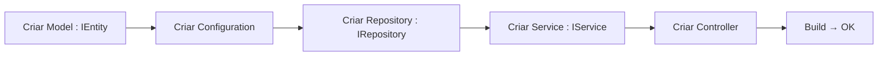

# reference/19 — Estrutura inicial do Decco.API (monolítica) vs versão automatizada

> **Propósito:** documentar como o código foi encontrado na primeira análise (v0.0.1, antes das refatorações) e como ficou
> após as automatizações. Serve de consulta para quem quiser entender o "antes" e decidir onde aplicar o mesmo padrão
> nas próprias alterações.

## 1. DataLayer — DbContext

### Antes (monolítico)
```
DeccoDbContext.cs (627 linhas)
├── 24 propriedades DbSet<T> declaradas manualmente
└── OnModelCreating com 24 blocos modelBuilder.Entity<T>(...) inline
    ├── Fluent API: chaves, colunas, índices, relacionamentos, triggers
    └── Tudo num único arquivo — viola SRP e causa conflitos de merge
```

Cada nova entidade exigia **2 toques** no `DeccoDbContext.cs`:
```csharp
// 1. Declarar DbSet
public virtual DbSet<NovaEntidade> NovaEntidades { get; set; }

// 2. Configurar no OnModelCreating
modelBuilder.Entity<NovaEntidade>(entity => { ... fluent API ... });
```

### Depois (automatizado — Abordagem 2)
```
DeccoDbContext.cs (13 linhas)
├── Sem DbSet<T> — usa Set<T>() em runtime
└── OnModelCreating → ApplyConfigurationsFromAssembly + partial hook
```

```
Models/
├── IEntity.cs              ← interface marcadora
├── Anomalium.cs : IEntity
├── Laboratorio.cs : IEntity
└── ... (21 entidades de tabela)
    Vw*.cs                  ← views NÃO implementam IEntity

Configurations/
├── AnomaliumConfiguration.cs    ← IEntityTypeConfiguration<Anomalium>
├── LaboratorioConfiguration.cs
└── ... (24 classes: 21 tabelas + 3 views)
```

Nova entidade exige:
1. Criar a classe model implementando `IEntity`
2. Criar `IEntityTypeConfiguration<T>` em `Configurations/`
3. **Zero** alterações no DbContext

### Porquê
- **SRP:** cada entidade tem sua própria classe de configuração
- **Zero conflito de merge:** o DbContext nunca mais é tocado ao adicionar entidades
- **Descoberta automática:** `ApplyConfigurationsFromAssembly(typeof(DeccoDbContext).Assembly)` varre todo o assembly

### Mecanismo de descoberta
```csharp
// DeccoDbContext.OnModelCreating
modelBuilder.ApplyConfigurationsFromAssembly(typeof(DeccoDbContext).Assembly);
OnModelCreatingPartial(modelBuilder);
```

```csharp
// Repository — sem DbSet, usa Set<T>()
await _ctx.Set<Anomalium>()
    .Include(a => a.ClasseObjeto)
    .ToListAsync();
```

---

## 2. DI — CompositionRoot

### Antes
```csharp
var assemblies = new[]
{
    typeof(IService).Assembly,
    typeof(IRepository).Assembly,
    typeof(IAnomaliaService).Assembly,   // redundante — já incluso via IService
    typeof(ErrorCodes).Assembly,
    typeof(DeccoDbContext).Assembly
};

RegisterByConvention(services, assemblies, typeof(IService), ServiceLifetime.Scoped);
RegisterByConvention(services, assemblies, typeof(IRepository), ServiceLifetime.Scoped);
```

Problemas:
- Lista **hard-coded** de assemblies — novo projeto exige novo typeof
- `IAnomaliaService` está no mesmo assembly que `IService` — redundante

### Depois (não refatorado — oportunidade documentada)
Pendente: scan automático de todos os assemblies do domínio, sem lista explícita.

### Padrão consolidado que FUNCIONA
- `IService` — interface marcadora em `Decco.Api.Common`
- `IRepository` — interface marcadora em `Decco.Api.Common`
- Qualquer classe que implemente uma subinterface destas é registrada automaticamente

---

## 3. Operations Layer — código morto removido

### Antes
```
Decco.Api.Operations/
├── IAnomaliaManager.cs
├── AnomaliaManager.cs
└── Decco.Api.Operations.csproj
```

O `AnomaliaManager`:
- Duplicava `AnomaliaService` com mapeamento próprio (`Anomalium ↔ AnomaliaDto`)
- **Não** estava registrado em DI (nenhuma interface marcadora, nenhuma linha no CompositionRoot)
- **Não** era referenciado por controller algum
- **Não** estava incluso no `.sln`

### Depois
Projeto removido. Zero impacto — não era referenciado por ninguém.

### Lição
Sempre que criar uma nova camada (ex.: `Operations`, `Domain`, `Workflows`), definir uma **interface marcadora** e incluí-la no scan do `CompositionRoot`. Do contrário, o código existe mas não roda.

---

## 4. Services — ErrorResponse centralizado

### Antes
Cada service tinha seu próprio helper `ErrorResponse<T>` privado:
- `CatCamadaOntologicaService`: só versão com `(string, string)`, usava `ex.Message`
- `LaboratorioService`: duas versões `(string, string)` + `(Exception)`
- `AnomaliaService`: sem helper — construía o response inline em cada catch
- Inconsistência: `ex.Message` vs `ErrorCodes.InternalError.DefaultMessage`

### Depois
```csharp
// Decco.Api.Common/ErrorResponseHelper.cs
public static class ErrorResponseHelper
{
    public static SingleResponse<T> Fail<T>(string code, string message) => ...;
    public static SingleResponse<T> Fail<T>() =>
        Fail<T>("INTERNAL_ERROR", "Erro interno do servidor");
    public static SingleResponse<T> NotFound<T>() =>
        Fail<T>("NOT_FOUND", "Registro não encontrado");
}
```

Uso uniforme em todos os 10 services:
```csharp
catch { return ErrorResponseHelper.Fail<T>(); }
if (entity == null) return ErrorResponseHelper.NotFound<T>();
```

### Porquê
- **Consistência:** todo erro interno usa a mesma mensagem e código
- **DRY:** 9 classes removem seu helper privado (~4 linhas cada)
- **Segurança:** não vaza detalhes da exceção (`ex.Message`) para o cliente

---

## 5. Controllers e Services — nomes uniformizados

### Antes
```csharp
// AnomaliaController
[HttpPost("ListAnomalias")]
[HttpPost("GetAnomalia")]
[HttpPost("InsertAnomalia")]
[HttpPost("UpdateAnomalia")]
[HttpPost("DeleteAnomalia")]

// CatCamadaOntologicaController (e todos os outros)
[HttpPost("List")]
[HttpPost("Get")]
[HttpPost("Insert")]
[HttpPost("Update")]
[HttpPost("Delete")]
```

Rotas diferentes para o mesmo padrão — `POST /api/Anomalia/ListAnomalias` vs `POST /api/CatCamadaOntologica/List`.

### Depois
```csharp
// Todos os controllers
[HttpPost("List")]
[HttpPost("Get")]
[HttpPost("Insert")]
[HttpPost("Update")]
[HttpPost("Delete")]
```

`IAnomaliaService` e `AnomaliaService` também tiveram os métodos renomeados para `List`, `Get`, `Insert`, `Update`, `Delete`.

---

## 6. Mapa completo: antes × depois por camada

| Camada | Antes (monolítico) | Depois (automatizado) | O que melhora |
|--------|-------------------|----------------------|---------------|
| **DataLayer** | 627 linhas, 24 DbSets + OnModelCreating manual | 13 linhas, `ApplyConfigurationsFromAssembly` | SRP, merge, escala |
| **Models** | POCOs sem marcador | 21 entidades implementam `IEntity` | Scanner encontra entidades |
| **Config** | Dentro do DbContext | 24 classes separadas em `Configurations/` | Isolamento, testabilidade |
| **Repositories** | `_ctx.Anomalia` (acoplado a DbSet) | `_ctx.Set<Anomalium>()` (genérico) | Desacoplado do DbSet name |
| **DI** | Lista hard-coded de assemblies | Scan por interface marcadora | Novo projeto = novo assembly automaticamente |
| **Operations** | Código morto (não registrado) | Removido | Menos confusão |
| **Error handling** | 9 helpers privados + 1 inline | 1 helper centralizado em Common | Consistência, segurança |
| **Controllers** | Nomes diferentes (`ListAnomalias` vs `List`) | Todos `List`/`Get`/`Insert`/`Update`/`Delete` | Padronização |
| **Services** | `GetAnomalia` vs `Get` | Todos `Get`/`List`/`Insert`/`Update`/`Delete` | Mesmo |

---

## 7. Padrão para adicionar uma entidade NOVA hoje



Passos concretos:
1. `Models/NovaEntidade.cs` — POCO implementando `IEntity`
2. `Configurations/NovaEntidadeConfiguration.cs` — `IEntityTypeConfiguration<NovaEntidade>`
3. `Repositories/INovaEntidadeRepository.cs` + `NovaEntidadeRepository.cs` — ambos estendem `IRepository`
4. `Services/INovaEntidadeService.cs` + `NovaEntidadeService.cs` — ambos estendem `IService`
5. `Controllers/NovaEntidadeController.cs` — 5 actions: List, Get, Insert, Update, Delete

**Nenhum arquivo existente é alterado.** O `CompositionRoot` e o `DbContext` descobrem tudo por scan de assembly.

---

## 8. Padrão para adicionar um NOVO projeto à solução

- Criar o projeto com `ImplicitUsings` e `Nullable` habilitados
- Adicionar referência a `Decco.Api.Common` (para `IService`/`IRepository`/`ErrorResponseHelper`)
- Definir uma **interface marcadora** para o novo tipo de componente, se houver
- Incluir o assembly no scan do `CompositionRoot` (pendente de automatização — ver `knowledge-drops/020`)

---

> **Próximo tópico de pesquisa:** substituir a lista hard-coded de assemblies no `CompositionRoot` por um scan
> de todos os assemblies carregados que referenciem `Decco.Api.Common`. Isto eliminaria a última "costura manual"
> do ponto 2.
